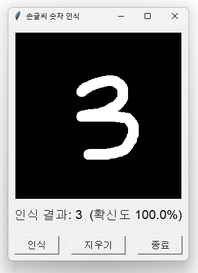
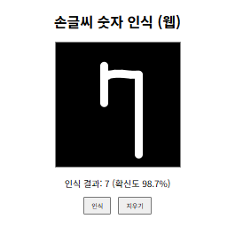

# 손글씨 숫자 인식

MNIST로 학습한 신경망(MLPClassifier)이 마우스로 그린 숫자를 인식하는 프로젝트. 같은 모델 구조와 전처리 로직을 공유하지만 런타임 파일은 공유하지 않는 두 개의 독립 구현으로 구성된다.

- `desktop_version/` — Tkinter GUI, 서버 없이 로컬에서 실행
- `web_version/` — Flask 백엔드 + HTML5 캔버스 프론트엔드, 로컬 웹 서버로 실행

| desktop_version | web_version |
|---|---|
|  |  |

## 실행 방법

두 버전 모두 실행 전 모델 학습이 필요하다 (`model.pkl` 생성, MNIST 최초 다운로드 시 인터넷 필요, 약 1분 소요).

### desktop_version

```
cd desktop_version
python train_model.py
python digit_app.py
```

또는 `run_digit_app.bat`을 더블클릭.

### web_version

```
cd web_version
pip install -r requirements.txt
python train_model.py
python app.py
```

`http://127.0.0.1:5000/` 접속.

## 환경

- Python 3.13 (miniconda)
- 공통 패키지: `numpy`, `pandas`, `scikit-learn`, `pillow`, `joblib` / web_version은 추가로 `flask`

## 전처리 로직

MNIST 정규화 방식을 그대로 재현: 그려진 영역의 바운딩 박스로 크롭 → 긴 변 기준 20px로 리사이즈(비율 유지) → 28x28 캔버스 중앙에 배치. 두 버전이 동일한 알고리즘을 각자 구현하고 있으므로, 한쪽을 수정하면 다른 쪽(`digit_app.py`의 `preprocess` 메서드 / `app.py`의 `preprocess` 함수)도 함께 업데이트해야 한다.

## 참고

- `model.pkl`은 `train_model.py`로 생성되는 빌드 산출물이며 직접 수정하지 않는다.
- 각 폴더의 `CLAUDE.md`에 더 자세한 아키텍처 설명이 있다.
