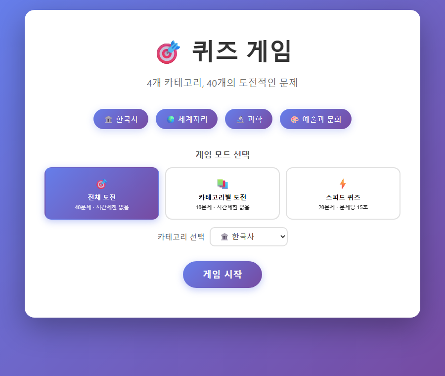
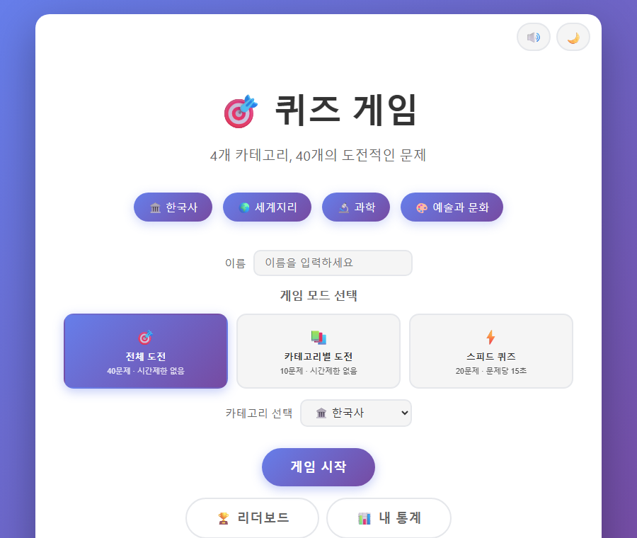

# 퀴즈 게임

한국사·세계지리·과학·예술과 문화 4개 카테고리, 총 40문제로 구성된 4지선다 상식 퀴즈 게임. 서버·회원가입·빌드 도구 없이 `index.html`을 브라우저에서 바로 열어서 사용한다.

- `Study-03-basic/` — 기본 버전. 3가지 게임 모드(전체 도전/카테고리별 도전/스피드 퀴즈), 힌트, 콤보 점수 시스템까지 포함한 순수 퀴즈 게임
- `Study-03-advanced/` — 기본 버전에 로컬 기록 저장·리더보드·내 통계·다크모드·사운드·학생 이름 기반 "선생님 모드"(성적 내보내기·비교 리포트)를 얹은 확장 버전. `.claude/commands/`에 문제 관리·리포트 생성용 슬래시 명령 포함

| Study-03-basic | Study-03-advanced |
|---|---|
|  |  |

## 실행 방법

각 폴더의 `index.html`을 더블클릭하거나 브라우저로 열면 된다 (예: `Study-03-basic/index.html`).

## 기능

### 공통 (basic + advanced)

- 전체 도전(40문제·무제한) / 카테고리별 도전(10문제) / 스피드 퀴즈(20문제·문제당 15초) 3가지 모드
- 힌트(오답 2개 제거, 최대 3회), 연속 정답 콤보 보너스, 응답 시간 보너스를 반영한 점수 시스템
- 문제별 즉시 피드백(정답/오답 표시 + 해설), 일시정지, 키보드 단축키(숫자키 답변, H 힌트, P 일시정지, Enter 다음 문제)

### advanced 전용

- `localStorage` 기반 게임 기록 저장, 리더보드(전체/주간/일간 · 카테고리 필터), 내 통계(카테고리별 정답률·최근 점수 추이)
- 다크모드, 사운드 효과, 결과 공유(클립보드 복사)
- 학생 이름 입력 + 기록을 JSON으로 내보내기("선생님 모드") — 여러 학생의 내보내기 파일을 모아 `/teacher-report`(또는 `/teacher-mode`) 명령으로 반 전체 비교 리포트 생성
- 문제 관리용 슬래시 명령: `/quiz-add`, `/quiz-check`, `/quiz-stats`, `/quiz-leaderboard`, `/quiz-range`, `/quiz-validate`, `/quiz-daily`

## 파일 구조

```
Study-03-basic/
  index.html, script.js, style.css   마크업/로직/스타일
  questions.js                       문제 데이터(quizQuestions 배열)

Study-03-advanced/
  index.html, script.js, style.css, storage.js, questions.js
  .claude/commands/                  퀴즈 관리·선생님 모드 슬래시 명령 정의
  .claude/teacher-data/              samples(테스트용 학생 기록) · reports(생성된 비교 리포트) · submissions(실제 학생 제출 파일, 비어있으면 samples 사용)
```

## 문제 데이터 모델

```js
{
  id: number,
  category: "한국사" | "세계지리" | "과학" | "예술과 문화",
  difficulty: "easy" | "medium" | "hard",
  question: string,
  options: string[4],
  correctAnswer: number,   // options의 인덱스
  explanation: string
}
```

## 기술 스택

프레임워크·빌드 도구 없이 순수 HTML/CSS/JavaScript로 작성.

## 참고

- 각 폴더의 `CLAUDE.md`에 더 자세한 구현 가이드가 있다.
- basic과 advanced는 같은 문제 데이터에서 출발했지만 이후 독립적으로 관리된다 — 문제를 추가/수정할 때 두 폴더의 `questions.js`가 서로 다를 수 있다는 점에 유의한다.
