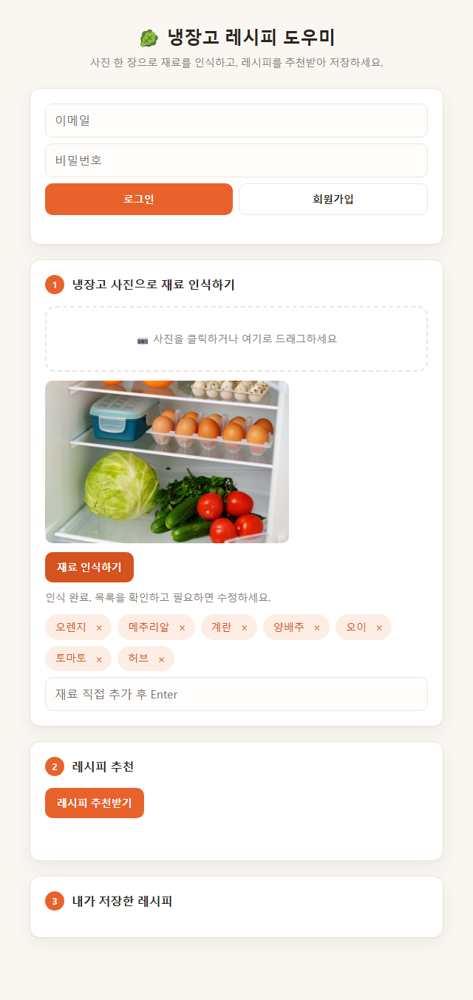

# 냉장고 레시피 도우미

냉장고 사진을 올리면 OpenRouter의 `google/gemma-4-26b-a4b-it:free` 모델이 재료를 인식하고, 그 재료로 만들 수 있는 레시피를 추천해주는 웹 앱. 회원가입 후 마음에 드는 레시피를 저장할 수 있다.



## 실행 방법

```
pip install -r requirements.txt
python -m uvicorn app:app --reload
```
브라우저에서 http://127.0.0.1:8000 접속.

`.env.example`을 참고해 `.env`에 `OPENROUTER_API_KEY`를 설정해야 한다.

OpenRouter API 상태만 빠르게 점검하려면 `python main.py`.

## 기능

1. **재료 인식** — 냉장고 사진 업로드 → AI가 보이는 식재료 목록을 인식, 필요하면 직접 추가/삭제
2. **레시피 추천** — 인식된 재료로 만들 수 있는 레시피 3개 추천 (사용 재료 / 부족한 재료 / 조리 순서 / 예상 조리 시간)
3. **레시피 저장** — 회원가입/로그인 후 마음에 든 레시피를 저장해서 "내가 저장한 레시피"에서 다시 확인·삭제

## 파일 구조

```
config.py           환경변수(.env) 로딩
vision.py            1단계: 이미지 -> 재료 인식
recipe.py            2단계: 재료 -> 레시피 생성
auth.py              3단계: 회원가입/로그인/레시피 저장 (SQLite, app.db)
app.py               FastAPI 서버 (라우팅)
static/index.html    프론트엔드 (순수 HTML/JS, 빌드 도구 없음)
main.py              OpenRouter API 동작 상태 점검용 스크립트
PRD_step1~3.md        단계별 기획 문서
```

## 기술 스택

- 백엔드: Python, FastAPI, SQLite(표준 라이브러리 `sqlite3`)
- 프론트엔드: 순수 HTML/CSS/JavaScript
- AI 모델: OpenRouter API의 `google/gemma-4-26b-a4b-it:free` (text+image+video→text 멀티모달, 무료)

## 참고

- 무료 모델 특성상 업스트림(Google AI Studio) 공유 풀에서 간헐적으로 429(rate limit)가 발생할 수 있다 — 정상적인 현상이며 재시도로 대응한다.
- 더 자세한 구현 가이드는 `CLAUDE.md`, 단계별 요구사항은 `PRD_step1.md`~`PRD_step3.md` 참고.
