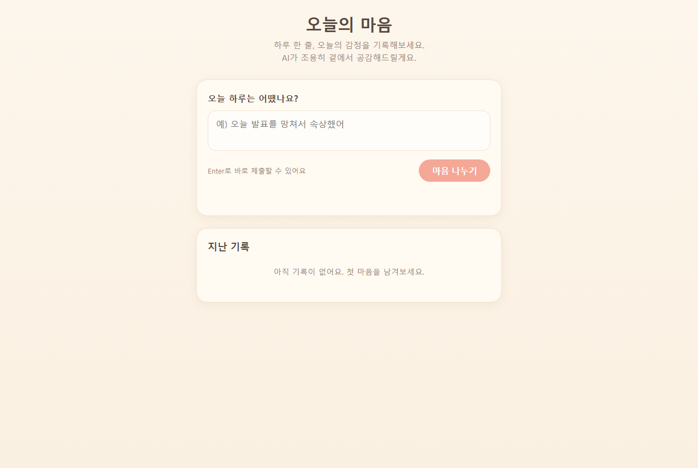
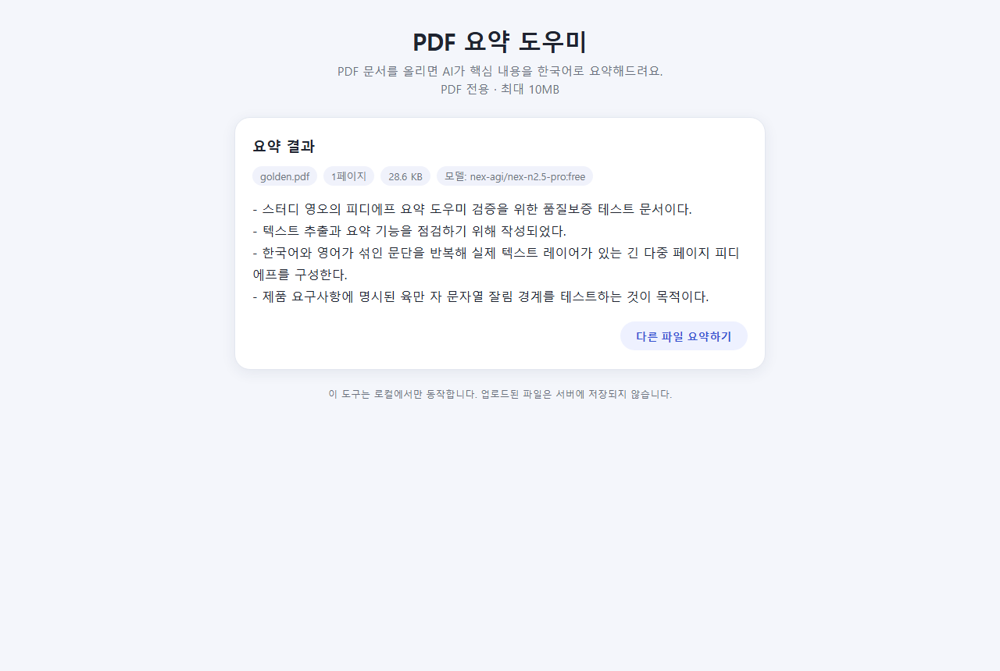

# Study-05

OpenRouter 무료 모델을 사용하는 웹 앱 2개.

- **AI 공감 다이어리** (`index.html`) — 한 줄 일기를 입력하면 감정을 분석하고 공감/위로 메시지를 생성. 서버 없이 브라우저에서 바로 여는 단일 파일 앱.
- **PDF 요약 웹앱** (`index_pdf.html` + `server/`) — PDF를 업로드하면 텍스트를 추출해 AI가 한국어로 요약. API 키를 서버에만 두기 위해 로컬 서버가 함께 필요하다.

| AI 공감 다이어리 | PDF 요약 웹앱 |
|---|---|
|  |  |

## 실행 방법

### AI 공감 다이어리

`index.html`을 더블클릭해서 연다.

커밋된 파일에는 API 키가 빈 문자열로 되어 있다(git에 시크릿이 남지 않도록 의도적으로 비워둠). `.env`의 `OPENROUTER_API_KEY` 값을 `index.html`의 `OPENROUTER_API_KEY = ""` 부분에 붙여넣은 뒤 로컬에서만 사용한다. 이 상태로 커밋하지 않는다.

### PDF 요약 웹앱

```
cd server
npm install
npm start
```
포트 3000에서 서버가 켜진 상태에서 `index_pdf.html`을 브라우저로 연다. `.env`의 `OPENROUTER_API_KEY`는 서버가 자동으로 읽으며, 프론트엔드 코드에는 키가 포함되지 않는다.

## 기능

### AI 공감 다이어리

1. 한 줄 일기 입력 → 감정 분석 및 공감 메시지 생성
2. `localStorage`에 기록 저장/삭제

### PDF 요약 웹앱

1. PDF 드래그&드롭 또는 클릭 업로드 (PDF만, 최대 10MB)
2. 텍스트 추출 후 AI 요약 생성, 파일명/페이지 수/모델명 등 메타 정보 함께 표시
3. 업로드 실패, 서버 미실행, AI 응답 오류 등 상황별 에러 메시지 + 재시도 버튼

## 파일 구조

```
index.html            AI 공감 다이어리 (단일 파일)
index_pdf.html          PDF 요약 웹앱 프론트엔드 (단일 파일, 서버 필요)
PRD.md                   PDF 요약 웹앱 기획 문서
server/
  src/
    index.js              엔트리 — .env 로드, 서버 기동
    app.js                 Express 앱, 라우팅
    routes/                GET /api/health, POST /api/summarize
    middleware/            업로드 검증, 공통 에러 처리
    services/               PDF 텍스트 추출, OpenRouter 요약 호출
    utils/                  에러 코드/메시지 정의
```

## 기술 스택

- 프론트엔드: 순수 HTML/CSS/JavaScript (빌드 도구 없음)
- PDF 요약 웹앱 백엔드: Node.js, Express
- AI 모델: OpenRouter API의 `nex-agi/nex-n2.5-pro:free` (무료)

## 참고

- 무료 모델 특성상 간헐적으로 429(rate limit)가 발생할 수 있다 — 정상적인 현상이며 재시도로 대응한다.
- 더 자세한 구현 가이드는 `CLAUDE.md`, PDF 요약 웹앱의 상세 요구사항은 `PRD.md` 참고.
